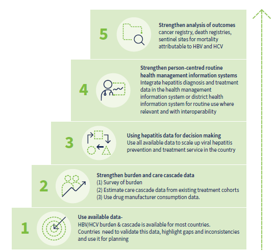
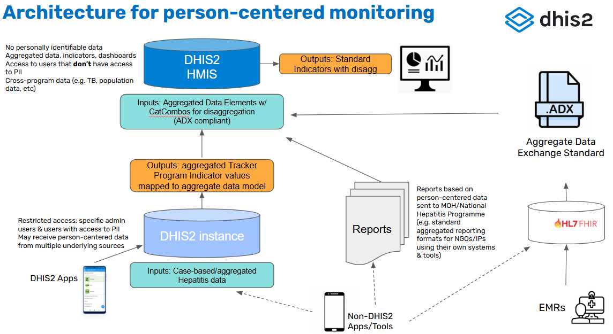
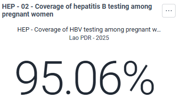
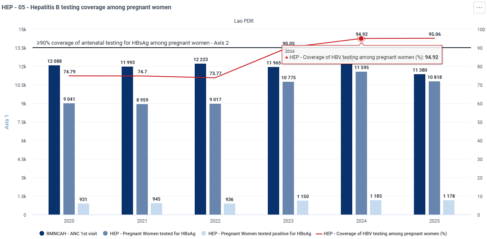
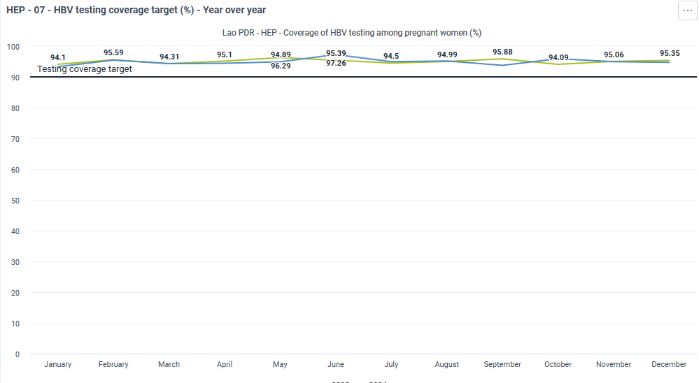
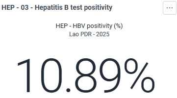
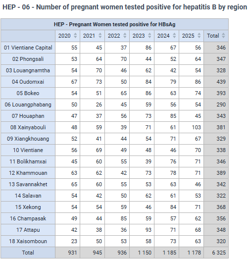
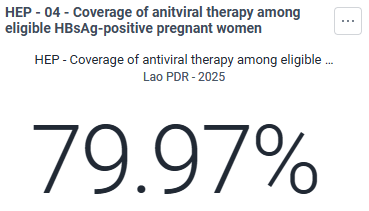
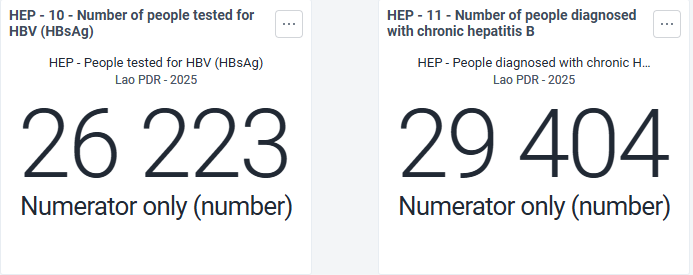
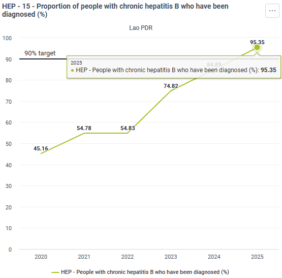

# Hepatitis - System Design Guide { #hep-agg-design }

## Introduction

The DHIS2 Hepatitis toolkit is based on the latest WHO [Consolidated guidelines on person-centred viral hepatitis strategic information: using data to support country scale-up of hepatitis prevention, diagnosis and treatment services](https://www.who.int/publications/i/item/9789240091313).

This toolkit includes:
- WHO-recommended dashboard analyses for monitoring hepatitis programs and using key metrics to adjust programming and drive impact
- Aggregate datasets and data elements to model aggregated tracker data for performant, anonymized analytics

The DHIS2 Hepatitis Toolkit aims to enhance data quality, improve monitoring, and facilitate timely response actions to achieve global hepatitis elimination goals. It is designed to streamline routine data management, strengthen surveillance systems, and enable data-driven health policies.

The system design document explains the reference configuration in DHIS2 for the Hepatitis use case, including a detailed description of the dashboard, DHIS2 configuration and implementation. This document also does not consider the resources and infrastructure needed to implement such a system, such as servers, power, internet connections, backups, training and user support, which can be found in the [DHIS2 Implementation Guide](https://docs.dhis2.org/en/implement/implementing-dhis2/overview.html).

Reference metadata for this toolkit is available at: [dhis2.org/metadata-downloads](http://dhis2.org/metadata-downloads).

### Aknowledgement

The Hepatitis toolkit has been developed in partnership with WHO with support from France Ministry of Europe and Foreign Affairs. We are grateful to WHO for providing subject matter expertise in the design and development of these tools, as well as to the many countries who have shared their implementation experience with us.

## System design overview

### Background

Chronic hepatitis B (HBV) and chronic hepatitis C (HCV) infections pose major global health challenges, contributing to liver disease, cirrhosis, and hepatocellular carcinoma (HCC). In 2022, an estimated **254 million** people lived with chronic **HBV** and **50 million** with chronic **HCV**, leading to **1.3 million deaths** and **2.2 million new infections**. The highest burden is in the **WHO African and Western Pacific Regions**, where **5% of the population** has chronic HBV. Diagnosis and treatment gaps remain significant, with only **13% of HBV cases diagnosed** and **3% receiving antiviral therapy**. Only 36% of people living with chronic HCV had been diagnosed between 2015 and 2022, and 20% had received curative treatment.

Key risk groups include **people who inject drugs (44% of new HCV infections), healthcare workers, people in prisons, and individuals receiving frequent blood transfusions**. While **HBV vaccination** has reduced perinatal transmission, **global birth-dose coverage remains low (45%)**, with the **lowest rates in Africa (18%)**.

The [WHO Consolidated guidelines on person-centred viral hepatitis strategic information: using data to support country scale-up of hepatitis prevention, diagnosis and treatment services](https://www.who.int/publications/i/item/9789240091313) recommend countries to build and strengthen person-centred routine health management information systems. Hepatitis programmes may be able to leverage existing DHIS2 used to monitor the cascade of care from individual patient monitoring at the facility level to aggregate reporting to the central level. This aligns with the Action 74 & 75 of the **WHO Global Health Sector Strategy (GHSS) 2022–2030** which emphasizes the need to integrate **hepatitis data into national health systems, improve surveillance, and track progress toward hepatitis elimination goals**.

This **System Design Guide** provides a **DHIS2-based approach** for monitoring hepatitis prevention, testing, and treatment programs, ensuring efficient data collection, integration, and decision-making at all levels.

#### Intended users

The Hepatitis system design focuses on meeting the needs of end users at all levels of the health system, including those responsible for implementing Hepatitis programmes in countries. This guide may be used as a resource to conduct trainings of hepatitis data managers for decision making as well as trainings of data entry staff for data capture at the facility level. 

These users may include:
- **Hepatitis program managers & staff (national & sub-national)**: data users who are responsible for routine analysis of data, using data to improve operations and programme strategies, and providing data-driven feedback to programme staff, including implementing partners, facilities, and other service delivery points
- **Hepatitis programme data managers**: users who are responsible for overseeing data collection, management, data quality, analysis and reporting functions for the national Hepatitis programme
- **System admins/HMIS focal points**: MOH staff and/or core DHIS2 team responsible for maintaining and improving data systems for health programmes, integrating data streams into national platforms, providing technical support for system design, adaptation and end user support; and maintaining the DHIS2 system over time
- **Implementing partners**: organizations who provide technical assistance to the national Hepatitis programme, collect and analyze data on behalf of the overall national programme strategy, and may be responsible for the operations of service delivery networks

### Design structure

The DHIS2 Hepatitis configuration is structured in two major components:
- **Dashboard and Indicators**: the Hepatitis dashboard and indicators are all served by the aggregate data model in DHIS2
- **Aggregate data sets**: aggregate datasets, data elements are configured according to the WHO’s Hepatitis analysis framework to populate the core indicators. Two datasets are designed to receive aggregated tracker data and model this data in a performant way, leveraging the advantages of the aggregate data model in DHIS2 for analysis. Alternatively, these datasets can also be used for aggregate paper-based reporting; or to store data reported routinely from other individual-level data systems in use, such as sites using EMRs or other mobile applications:
  - Hepatitis
  - Hepatitis - Population estimation

These modular components are designed based on the heterogeneous nature of Hepatitis data systems in countries and support the typical architecture for implementing case-based data systems alongside integrated national HMIS infrastructure:

## Dashboard

Thematic dashboards for monitoring various aspects of Hepatitis programming have been developed based on the core indicators included on the [Consolidated guidelines on person-centred viral hepatitis strategic information: using data to support country scale-up of hepatitis prevention, diagnosis and treatment services](https://www.who.int/publications/i/item/9789240091313). Standard dashboard visualizations developed with WHO’s guidance can be rendered at national or sub-national levels depending on user configuration. For each visualization, the global targets for hepatitis elimination have been included for reference. National or subnational level targets may be used as outline in the hepatitis program strategic plan. Dashboards are served entirely by DHIS2 indicators as described in the next section. The following dashboards are available for routine analysis of Hepatitis activities.

The dashboard visualisations presented in this document have developed with *dummy* data and are not intended to show real-time country data. Screenshots of visuals that have been taken from the DHIS2 demon instance contain regional names and map of Lao People’s Democratic Republic, reproduced with kind permission from the Ministry of Health

### EMTCT of HBV

#### Coverage of hepatitis B testing among pregnant women

Number of pregnant women tested for HBsAg, divided by Number of pregnant women attending antenatal care services

*Target*: ≥90%

- The purpose of these visualisations is to observe the level of effort made to diagnose HBV among pregnant women attending antenatal clinics
- Testing for HBV in pregnancy is the first step in preventing the mother-to-child transmission of HBV. 
- This indicator also monitors programmatic targets used for validating the elimination of mother-to-child transmission of HBV and path to elimination of hepatitis B as a public health threat.
- The WHO goal for coverage of HBsAg testing among pregnant women is ≥90% ( in countries with targeted timely hepatitis B birth dose vaccine or without universal timely hepatitis B birth-dose vaccine) 
- *National representativeness*: If this indicator is measured only in a subset of facilities, comments should be added on the source of information, sample size and whether the information is representative of all sites where hepatitis treatment and care are delivered

- The purpose of this visualisation is to observe trends in HBV testing coverage monthly, over a period of one year. Over time, trends in the test coverage can reveal important patterns, such as seasonal variations, changes in positivity results. This information is vital for long-term planning and strategy development.By increasing testing coverage programmes can ensure early detection and leading to timely and appropriate treatment

#### Hepatitis B test positivity

- The purpose of this visualisation is to examine  the burden of HBV among the pregnant women attending antenatal clinic
- This percentage is affected by the prevalence of HBV in the general population
- There is no target goal for the percentage of tested pregnant women who should be positive 
- *National representativeness*: If this indicator is measured only in a subset of facilities, comments should be added on the source of information, sample size and whether the information is representative of all sites where hepatitis treatment and care are delivered

- The purpose of this visualisation is to observe the trend in the number of HBV infected pregnant women across different subnational regions
- Monitoring the number of HBV positive pregnant women allows the planning of resources for HBV treatment

#### Coverage of antiviral therapy among eligible HBsAg positive pregnant women

Number of HBsAg-positive pregnant women who meet eligibility criteria and received hepatitis B antiviral therapy for their own health and those on antiviral prophylaxis to reduce mother-to-child transmission, divided by  number of pregnant women who were eligible for either hepatitis B antiviral prophylaxis or treatment for their own health

*Target*: ≥90%

- The purpose of this visualisation is to observe the proportion of pregnant women attending antenatal care services who received antiviral drugs (for prophylaxis or treatment) according to national policy, in accordance with WHO guidelines
- Antiviral coverage is a further measure of sustained service quality throughout antenatal care. 
- This indicator also monitors programmatic targets used for validating the elimination of mother-to-child transmission of HBV and elimination and path to elimination of hepatitis B as a public health threat.
- *National representativeness*: If this indicator is measured only in a subset of facilities, comments should be added on the source of information, sample size and whether the information is representative of all sites where hepatitis treatment and care are delivered

### HBV

#### Number tested and diagnosed with chronic HBV

- **Number of people tested for HBV (HBsAg)**: The purpose of this visualisation is to observe the number of HBV tests used. The number of HBV tests can be an indicator of how well the healthcare system is functioning in terms of HBV detection. If the number of tests is lower than expected, it might suggest barriers to access, lack of resources, or insufficient awareness among the population. If low, assess the effectiveness of the HBV program. It helps determine whether initiatives to encourage testing are working and if people at risk are being reached. Shortages of testing supplies, shortage of trained staff, can lead to a decrease in the number of tests performed. Barriers to accessing healthcare, such as clinic closures, reduced hours, or geographic isolation, inefficient sample transportation networks can lead to fewer people being tested for HBV. This can be especially significant in rural or underserved areas. 
- **Number of people diagnosed with chronic hepatitis B**: The purpose of this visualisation is to observe the number of HBV infected population. Monitoring the number of people diagnosed with HBV allows the planning of resources for HBV treatment

#### Proportion of estimated people with chronic hepatitis B diagnosed

Number of people with chronic hepatitis B infection who have been diagnosed with a positive HBsAg test by the end of the reporting year divide by estimated total number of people with chronic hepatitis B infection (HBsAg positive)

*Target*: ≥90%

- The purpose of this visualisation is to observe the proportion of people with chronic hepatitis B (HBsAg positive) who have been diagnosed
- The trends of  diagnosis coverage should be relatively consistent and increasing over time. Identifying a large year-to-year variations allows the program to detect problems with surveillance activities and/ or changes in services (trained staff, equipment, quality of laboratory testing)
- This indicator is essential to measure the programmatic targets of the path to elimination and full validation of elimination of hepatitis B as a public health threat by 2030. 
- The WHO goal for coverage of HBV diagnosis in the general population is ≥90% 
- National representativeness: If this indicator is measured only in a subset of facilities, comments should be added on the source of information, sample size and whether the information is representative of all sites where hepatitis treatment and care are delivered

